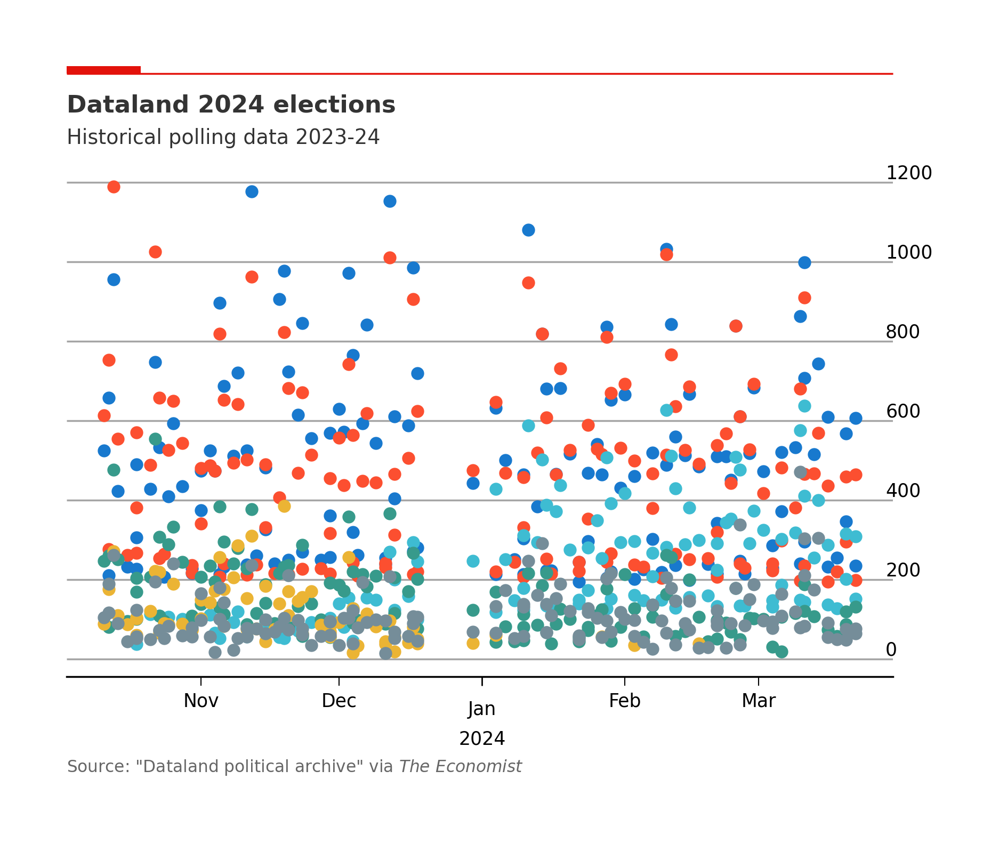

Election forecast
---
A Python framework for analysing current trends and predicting election outcomes from polling data.



## Get the code
You can download the code by cloning:
```commandline
git clone https://github.com/edoaltamura/election-predictions.git
```

## Run the pipeline
A demo version of the pipeline can be run via the `main.py` file. On Unix-based systems (and subsystems), you can type
```shell
python3 main.py
```
On Windows-based systems, you can type
```commandline
python main.py
```

## Set-up
### By creating a virtual environment
Assuming you have installed `venv` and `virtualenv` and have an up-to-date version of `pip` (see [instructions](https://packaging.python.org/en/latest/guides/installing-using-pip-and-virtual-environments/)), you can follow this two-step guide to set up this Python library and get it up and running in your system. The election-prediction code was developed to be compatible across all platform, however we will assume the Windows-native `python` run command in what follows, rather than the Unix-native `python3`.
- Create a virtual environment for this project, and activate it.
```commandline
python -m venv env
.\env\Scripts\activate
```
- Install the required packages.
```commandline
python3 -m pip install -r requirements.txt
```
Now the code should be ready to run within the virtual environment. To exit the virtual environment, you can run the command:
```commandline
deactivate
```

### Via PyCharm
Under the menu __Git | VCS__, click on __Clone...__ and enter the GitHub link to this repository. PyCharm can automatically detect the `requirements.txt` file and prompt the installation of the packages within it. We recommend selecting the creation of a project-specific virtual environment.

**Development:** If you plan to introduce new packages or libraries, we recommend using the __Tools__ menu > __Sync Python Requirements__ feature to update the `requirements.txt` file programmatically.

### Via `setup.py` (beta)
This feature is currently under testing, and we recommend setting up the repository via the methods above. 

After cloning the repository to a local host, enter the `election-predictions` directory
- `dir election-predictions` on Windows
- `cd election-predictions` on Unix systems
- 
and run
```commandline
pip install . 
```
`pip` will use `setup.py` to install this module, without needed to call `setup.py` explicitly.


**Note:** You should exclude your virtual environment directory from your version control system using `.gitignore` or similar.

## Graphic design

The layout attempts to match the style of the plots in _The Economist_ using `matplotlib` style sheets and dynamic aspect ratio scaling.

## Cite this software
You can print an up-to-date `bibtex` citation handle via:
```python
from src import __cite__

print( __cite__ )
```
This code dynamically allocates the current version of the code being uses and the date of the latest update, as given by the latest Git commit in the Git history.

A template of the citation handle is illustrated below:
```text
@software{altamura_elections
          author = {{Altamura}, Edoardo},
          title = {"An statistical machine learning framework for election predictions"}
          url = {https://github.com/edoaltamura/election-predictions}
          version = {__version__}
          date = {__date_last_update__}
}
```

## Licence
```text
Permission is hereby granted, free of charge, to any person obtaining a copy
of this software and associated documentation files (the "Software"), to deal
in the Software without restriction, including without limitation the rights
to use, copy, modify, merge, publish, distribute, sublicense, and/or sell
copies of the Software, and to permit persons to whom the Software is
furnished to do so, subject to the following conditions:

The above copyright notice and this permission notice shall be included in
all copies or substantial portions of the Software.

THE SOFTWARE IS PROVIDED "AS IS", WITHOUT WARRANTY OF ANY KIND, EXPRESS OR
IMPLIED, INCLUDING BUT NOT LIMITED TO THE WARRANTIES OF MERCHANTABILITY,
FITNESS FOR A PARTICULAR PURPOSE AND NONINFRINGEMENT. IN NO EVENT SHALL THE
AUTHORS OR COPYRIGHT HOLDERS BE LIABLE FOR ANY CLAIM, DAMAGES OR OTHER
LIABILITY, WHETHER IN AN ACTION OF CONTRACT, TORT OR OTHERWISE, ARISING FROM,
OUT OF OR IN CONNECTION WITH THE SOFTWARE OR THE USE OR OTHER DEALINGS IN
THE SOFTWARE.
```